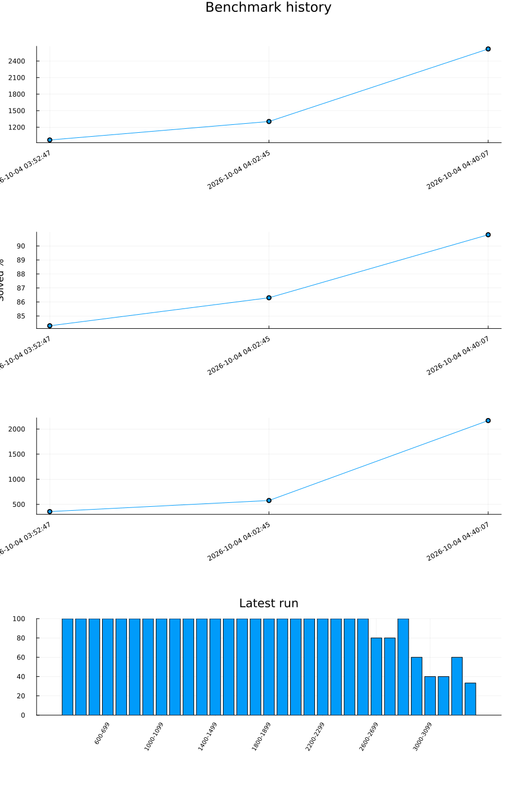

A personal project of creating a chess engine in Julia. The bot has been implemented on Lichess, and the bot account is [JuliaEngine](https://lichess.org/@/JuliaEngine).

Rules, boards, and legal moves come from [Chess.jl](https://github.com/romstad/Chess.jl). This project implements both the minimax and monte carlo trees search algorithms.

## How a move is chosen

`src/uci.jl` speaks UCI. A GUI or the Lichess bot sends a `position` and a `go` command. The engine turns the clock into a time budget, searches, and prints `bestmove`.

The default search is minimax. `MinimaxSearch` finishes its starting depth, then searches one ply deeper for as long as the remaining time is longer than the previous iteration. Pass `--search=mcts` to use Monte Carlo tree search instead.

```
julia --project=. src/uci.jl
julia --project=. src/uci.jl --search=minimax --depth=4
julia --project=. src/uci.jl --search=mcts --sims=10000
```

`--depth` is the first depth minimax must finish. `--sims` is the number of Monte Carlo simulations that must finish before a time limit can end the search. The default depth is 3 and the default simulation count is 10,000.

### Minimax

`move` in `src/minimax.jl` walks the legal moves with alpha-beta pruning. The score is white-relative centipawns. A shorter mate scores higher than a longer one, and a repeated position scores 0.

At depth 0 the search does not stop on a quiet evaluation if tactics are still on the board. Quiescence keeps searching captures and promotions for up to 8 plies. A side that is not in check may stand pat with the static score. A side that is in check has to answer it.

Each node tries moves in this order:

1. The best move stored for this position in the transposition table.
2. Promotions, higher-valued pieces first.
3. Captures, ordered by static exchange evaluation.
4. Everything else.

The transposition table remembers the score, whether that score is exact or a bound, and the move that produced it. The next search of the same position tries that move first and can return the stored score when the stored depth is deep enough. The table is cleared when a new game starts and kept across the deepening iterations of one move.

The static score is material plus a piece-square table: pawns 100, knights 320, bishops 330, rooks 500, queens 900. The search updates that score as it makes and unmakes moves, instead of scanning the board again at every node.

### Monte Carlo tree search

`mcts` in `src/engine.jl` grows a tree from the current position. Each node keeps at most 10 children. Selection uses UCB1 with an exploration term of 2. A leaf is scored by playing random moves until the game ends, then that result is added back up the path, flipping sign at each ply. The move played is the child that was visited most.

The puzzle benchmark below measures minimax only.

### NNUE

`src/NNUE.jl` is a separate piece-square network. Each piece on a square is a feature, two accumulators of size 128 read the board from White's side and from Black's side, and a hidden layer of size 32 produces a score. The minimax and Monte Carlo searches still use the piece-square table. The network can be constructed, evaluated, saved, and loaded, and the tests cover that.

## Layout

| Path | What it does |
| --- | --- |
| `src/uci.jl` | UCI loop: `position`, `go`, `stop`, `quit` |
| `src/searches.jl` | Time budget, iterative deepening, and the switch between the two searches |
| `src/minimax.jl` | Alpha-beta, quiescence, mate distance, repetition |
| `src/engine.jl` | Monte Carlo tree search |
| `src/evaluation.jl` | Material and piece-square tables |
| `src/move_ordering.jl` | Move order for alpha-beta and quiescence |
| `src/transposition.jl` | Transposition table |
| `src/NNUE.jl` | Piece-square network, separate from the searches |
| `test/` | Tests for evaluation, quiescence, repetition, the transposition table, tactics, and the network |
| `scripts/puzzles_benchmark.jl` | Runs the puzzle set and can append a row to the history |
| `data/benchmark_puzzles.jl` | The 153 Lichess puzzles used by that benchmark |
| `data/benchmark_history.csv` | Saved runs |
| `data/benchmark_history.png` | The graph drawn from those runs |

`src/JuliaChess.jl` exports the Monte Carlo helpers. The UCI program loads the search files directly with `include`.

## Performance

The graph is regenerated from `data/benchmark_history.csv` whenever a benchmark run is saved.



Every saved run is minimax at depth 8 on the same 153 puzzles. The final rating is the highest puzzle rating at which every selected puzzle of that rating or lower was solved. A puzzle above that line can still be solved. The rating drops at the first miss.

| Run | Solved | Final rating | Time | Note |
| --- | --- | --- | --- | --- |
| 2026-10-04 03:52 | 129/153 (84.3%) | 969 | 6 min | |
| 2026-10-04 04:02 | 132/153 (86.3%) | 1304 | 10 min | |
| 2026-10-04 04:40 | 139/153 (90.8%) | 2619 | 36 min | Added quiescence search |
| 2026-10-04 12:28 | 139/153 (90.8%) | 2619 | 108 min | One board per node, cheaper ordering, and a transposition table reused across the search |
| 2026-10-04 14:43 | 139/153 (90.8%) | 2619 | 56 min | Removed the cheaper ordering |

Quiescence is the change that moved the rating, from 1304 to 2619, and raised the solve rate from 86.3% to 90.8%. The two later runs solved the same puzzles. The middle panel is that solve rate. The third panel is how long the fixed depth took: the run that searched on one board, used cheaper ordering, and reused the transposition table took 108 minutes, and the next run, after the cheap search optimization was removed, took 56 minutes. The rating stayed at 2619.

The bottom chart is the latest run, split into rating bands of 100. That run solves the bands through 2500, then 4 of 5 at 2600 and 2700, all 5 at 2800, and a shrinking share after that. The highest puzzle it solved was rated 3319. The lowest one it missed was rated 2683, which is why the final rating stays at 2619.

To run the tests:

```
julia --project=. test/runtests.jl
julia --project=. test/runtests.jl 4
```

The default test depth is 3.

To run the puzzle benchmark:

```
julia --project=. scripts/puzzles_benchmark.jl
julia --project=. scripts/puzzles_benchmark.jl 4
```

The default benchmark depth is 3. After the results print, the script asks whether to save the run and whether to attach a note. A saved run appends a row to `data/benchmark_history.csv` and redraws `data/benchmark_history.png`.
